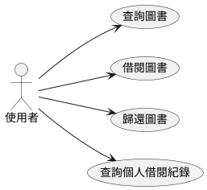
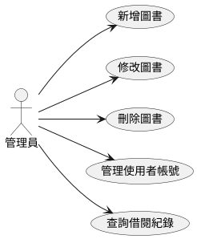
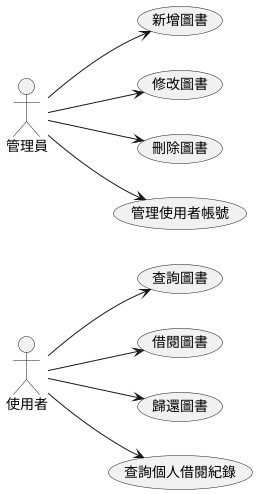
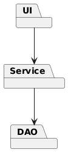
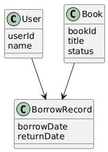
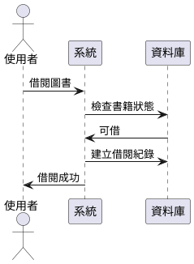
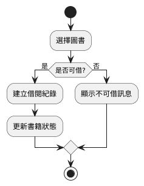

# chatgptai2
# 圖書館書庫管理系統

📋 **目錄**

* 需求說明書
* 概要設計說明書
* 詳細設計說明書
* 測試計畫
* 結論與未來展望

---

## 一、需求說明書（Software Requirement Specification, SRS）

### 1.1 系統目的

本系統旨在建置一套完整之**圖書館書庫管理系統**，協助圖書館進行：

* 圖書資料管理
* 讀者借書與還書管理
* 借閱紀錄查詢
* 系統與帳號管理

以提升作業效率、降低人工作業錯誤，並提供穩定可靠的資訊化管理機制。

---

### 1.2 使用者角色（User Roles）

#### （一）使用者（Reader）

* 查詢圖書
* 借閱圖書
* 歸還圖書
* 查詢個人借閱紀錄

#### （二）管理員（Admin）

* 新增、修改、刪除圖書
* 使用者帳號管理
* 借閱紀錄管理
* 系統維護

---

### 1.3 功能性需求（Functional Requirements）

* **FR1**：使用者可登入與登出系統
* **FR2**：可依書名、作者、ISBN 查詢圖書
* **FR3**：使用者可借閱圖書並記錄借閱時間
* **FR4**：使用者可歸還圖書並更新庫存狀態
* **FR5**：管理員可管理書籍與使用者資料

---

### 1.4 非功能性需求（Non-Functional Requirements）

* 效能需求：一般查詢回應時間 ≤ 3 秒
* 安全性需求：使用者密碼需加密儲存
* 可用性需求：操作介面簡單直覺
* 可靠性需求：借閱資料不可遺失

---

### 1.5 介面需求

* 圖形化使用者介面（GUI）
* 提供登入畫面、主選單、圖書查詢頁、管理頁面

---

### 1.6 UML：使用案例圖（Use Case Diagram）

---

## 二、概要設計說明書（High-Level Design）

### 2.1 系統架構

本系統採用**三層式架構（Three-Tier Architecture）**：

1. 表現層（UI Layer）
2. 商業邏輯層（Service Layer）
3. 資料存取層（Data Access Layer）

---

### 2.2 系統模組劃分

* 使用者管理模組
* 圖書管理模組
* 借閱管理模組
* 查詢模組

---

### 2.3 模組關係（Component Diagram）

---

### 2.4 類別設計（Class Diagram）

---

## 三、詳細設計說明書（Detailed Design）

### 3.1 借閱流程（Sequence Diagram）

---

### 3.2 借書流程說明

1. 使用者選擇欲借閱書籍
2. 系統檢查書籍狀態
3. 建立借閱紀錄
4. 更新書籍狀態為「已借出」
5. 回傳借閱成功訊息

---

### 3.3 UML：活動圖（Activity Diagram）

---

## 四、測試計畫（Test Plan）

### 4.1 測試目標

驗證系統功能正確性、模組整合性與流程完整性，確保系統符合需求規格。

### 4.2 功能測試項目

* 登入功能測試
* 圖書查詢測試
* 借閱功能測試
* 歸還功能測試

---

## 五、結論與未來展望

### 5.1 結論

本系統完成圖書館書庫管理核心功能，並以 UML 輔助系統分析與設計，確保系統具備良好結構與可維護性。

### 5.2 未來展望

* 逾期罰款機制
* 書籍預約功能
* Web 與行動裝置版本
